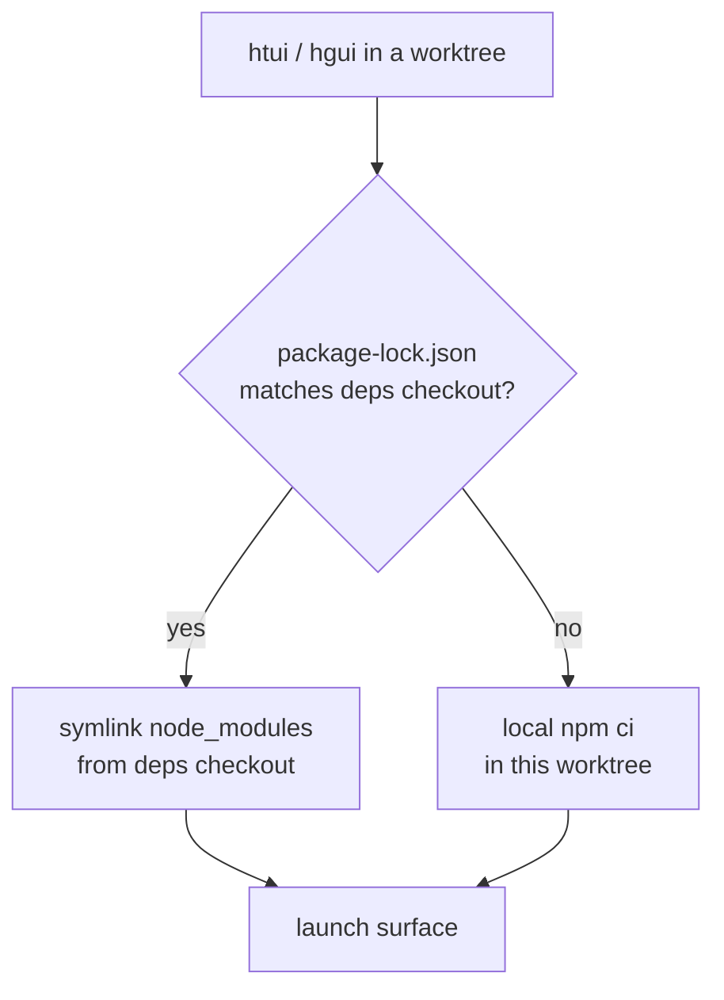

# 从 Worktree 开发 TUI 与桌面应用

Python 核心在任何 [git worktree](../user-guide/git-worktrees.md) 中都能正常运行 —— `cd` 进去，`hermes` 就能直接用。但两个 TypeScript 界面不行：`ui-tui/` 和 `apps/desktop/` 各自都需要一份完整的 `node_modules`，而为每个 worktree 执行一次全新的 `npm ci` 既慢，又会在你签出的每个分支上重复占用数 GB 空间。

`htui` 和 `hgui` 是两个用来弥补这一差距的 shell 辅助函数。它们各自**从当前 worktree** 启动对应界面，同时从一个规范 checkout 借用 `node_modules` —— 于是一个用完即弃的分支只需要一个符号链接，而不是一次安装。

它们是开发者的便利工具，并非随产品发布的命令。把它们放进 `~/.zshrc`；路径可按需调整。

## 依赖共享模型

有一个 checkout 是**依赖 checkout** —— 即你真正执行 `npm install` 的那一处。其他所有 worktree 都链接到它，只有当自身的 lockfile 出现分歧时才在本地重新安装（升级了依赖的分支绝不能悄悄地基于过期的包运行）。



两个环境变量用于指定规范 checkout：

| 变量 | 含义 |
|----------|---------|
| `HERMES_MAIN_CHECKOUT` | 依赖 checkout —— `node_modules` 真正所在之处，其 `.venv/bin/python` 也用于运行后端。 |
| `HERMES_GUI_DEPS_CHECKOUT` | 桌面应用依赖（`apps/desktop/node_modules`）所在之处。默认与 `HERMES_MAIN_CHECKOUT` 相同；仅当你把桌面依赖放在别处时才需要覆盖。 |

两者都不会被 Hermes 本身读取 —— 它们是这些辅助函数的私有变量。Hermes *确实*会读取的变量参见[环境变量](../reference/environment-variables.md)。

## `htui` —— 从 worktree 运行 TUI

Ink TUI 本身已有一条开发路径：`hermes --tui --dev` 会通过 `tsx` 运行 TypeScript 源码，而不是预构建的产物。`htui` 是对它的一层单行封装，并额外把这次运行指向当前 worktree 的 `ui-tui/`：

```bash
htui() {
  local root
  root="$(_hermes_root)" || { echo "htui: not in a Hermes checkout" >&2; return 1; }
  ( cd "$root" && PYTHONPATH="$root" \
      "$HERMES_MAIN_CHECKOUT/.venv/bin/python" -m hermes_cli.main --tui --dev "$@" )
}
```

`--dev` 会从源码编译，因此当根目录 lockfile 匹配时它会从 `HERMES_MAIN_CHECKOUT` 链接 `ui-tui/node_modules`，否则就在本地安装（参见 [`_hermes_root` / 链接辅助函数](#shared-helpers)）。

:::warning `--dev` 与 `HERMES_TUI_DIR` 互斥
`HERMES_TUI_DIR` 会把 Hermes 指向一份*预构建*产物（Nix、系统软件包），它没有可热重载的源码。如果你的 shell 中设置了该变量，`hermes --tui --dev` 会报错退出。运行 `htui` 前请先 `unset HERMES_TUI_DIR`。
:::

## `hgui` —— 从 worktree 运行桌面应用

桌面应用更重一些：它在仓库根目录和 `apps/desktop/` 下都需要 `node_modules`，需要一个固定在 `5174` 端口的 Vite 开发服务器，还需要一个 Python 后端。`hgui` 把这一切都接到当前 worktree 上：

```bash
hgui() {
  local root deps desktop
  root="$(_hermes_root)" || { echo "hgui: not in a Hermes checkout" >&2; return 1; }
  deps="${HERMES_GUI_DEPS_CHECKOUT:-$HERMES_MAIN_CHECKOUT}"
  desktop="$root/apps/desktop"

  # lockfile 匹配时借用依赖；否则在 worktree 中本地安装。
  if cmp -s "$root/package-lock.json" "$deps/package-lock.json"; then
    _hermes_link_deps "$desktop" "$deps/apps/desktop"
    _hermes_link_deps "$root" "$deps"
  else
    ( cd "$root" && npm ci ) || return 1
  fi

  # Vite 固定使用 5174 —— 清掉另一个 hgui 留下的陈旧会话。
  lsof -t -i:5174 >/dev/null 2>&1 && killport 5174

  # Electron 经常在 Ctrl+C 后存活，且不回收它的临时后端。
  trap '_hermes_gui_cleanup "$root"' INT TERM EXIT

  ( cd "$desktop"
    export PATH="$root/node_modules/.bin:$PATH"
    HERMES_DESKTOP_HERMES_ROOT="$root" \
    HERMES_DESKTOP_PYTHON="$HERMES_MAIN_CHECKOUT/.venv/bin/python" \
    HERMES_DESKTOP_IGNORE_EXISTING=1 \
    HERMES_DESKTOP_CWD="$root" \
    npm run dev )
}
```

它设置的桌面端环境变量都是真实的后端解析开关：

| 变量 | 在 `hgui` 中的作用 |
|----------|----------------|
| `HERMES_DESKTOP_HERMES_ROOT` | 从**当前 worktree** 运行后端，而不是打包版或 PATH 上的 `hermes`。 |
| `HERMES_DESKTOP_PYTHON` | 复用依赖 checkout 的 venv，而不是重新解析一个 Python。 |
| `HERMES_DESKTOP_IGNORE_EXISTING` | 忽略 `PATH` 上任何 `hermes`，避免它遮蔽 worktree。 |
| `HERMES_DESKTOP_CWD` | 让桌面对话以该 worktree 为根打开。 |

`hgui` 处理了两个裸 `npm run dev` 不会处理的坑：

- **`5174` 端口是固定的。** 第二个 `hgui` 会与第一个的 Vite 服务器冲突；辅助函数会先杀掉陈旧的那个。
- **孤儿子进程。** Electron 经常在 `concurrently` 下从 `Ctrl+C` 中存活下来，却不回收临时的 `dashboard --port 0` 后端或 Vite 进程。`EXIT`/`INT`/`TERM` trap 会执行一次清理，终止 Electron 外壳、`:5174` 监听者，以及它派生的任何 `--port 0` dashboard。

## 共享辅助函数 {#shared-helpers}

两个函数都以同样的方式解析所在 checkout 并链接依赖：

```bash
# 所在的 worktree，并校验它确实是一个 Hermes checkout。
_hermes_root() {
  local root
  root="$(git rev-parse --show-toplevel 2>/dev/null)" || return 1
  [[ -f "$root/hermes_cli/main.py" && -d "$root/ui-tui" ]] && print -r "$root"
}

# 从依赖 checkout 符号链接 node_modules —— 绝不覆盖已存在的目录树。
_hermes_link_deps() {
  local target="${1%/}" source="${2%/}"
  [[ -d "$source/node_modules" ]] || return 1
  [[ -e "$target/node_modules" ]] || ln -s "$source/node_modules" "$target/node_modules"
}

# 回收 Electron 退出时留下的临时后端。
_hermes_gui_cleanup() {
  local root="$1"
  [[ -n "$root" ]] && pkill -TERM -f "${root}/apps/desktop/node_modules/electron" 2>/dev/null
  lsof -t -i:5174 >/dev/null 2>&1 && killport 5174
  pgrep -f 'hermes_cli\.main.*dashboard.*--port 0' 2>/dev/null | xargs -r kill -TERM 2>/dev/null
}
```

`killport` 是你自己的一个小辅助函数（`lsof -ti:$1 | xargs kill`）；换成你惯用的写法即可。

:::info 为什么只在 lockfile 匹配时才链接
链接到一份有分歧的 `node_modules` 比不安装更糟 —— worktree 会基于自己 lockfile 从未声明过的包进行构建。逐字节比较 `package-lock.json` 是最廉价、最精确的防护：lockfile 相同 ⇒ 可以安全借用；lockfile 不同 ⇒ 在本地 `npm ci`。Vite 会在执行 `server.fs.allow` 前把符号链接解析为真实路径，这也是 `apps/desktop/vite.config.ts` 要把真实的 `node_modules` 位置加入白名单的原因。
:::

## 参见

- [Git Worktrees](../user-guide/git-worktrees.md) —— 这些辅助函数所依赖的隔离模型
- [TUI](../user-guide/tui.md) —— `hermes --tui --dev` 与 `HERMES_TUI_DIR` 预构建路径
- [桌面应用](../user-guide/desktop.md) —— 从源码构建与后端解析优先级
- [`apps/desktop/README.md`](https://github.com/NousResearch/hermes-agent/blob/main/apps/desktop/README.md) —— 开发服务器、沙箱脚本与打包
- [环境变量](../reference/environment-variables.md) —— Hermes 会读取的每一个 `HERMES_*` 变量
