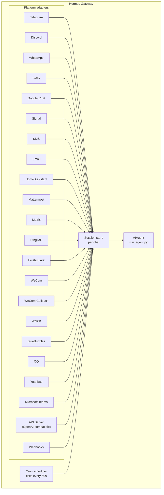

# 消息网关

通过 Telegram、Discord、Slack、WhatsApp、Signal、SMS、Email、Home Assistant、Mattermost、Matrix、DingTalk、Feishu/Lark、WeCom、Weixin、BlueBubbles（iMessage）、QQ、Yuanbao、Microsoft Teams、LINE、ntfy 或浏览器与 Hermes 对话。网关是一个单一后台进程，连接所有已配置的平台，管理会话，运行 cron 任务，并传递语音消息。

完整的语音功能集——包括 CLI 麦克风模式、消息中的语音回复以及 Discord 语音频道对话——请参阅 [Voice Mode](/user-guide/features/voice-mode) 和 [Use Voice Mode with Hermes](/guides/use-voice-mode-with-hermes)。

:::tip
机器人同时需要模型提供商和工具提供商（TTS、网页）。[Nous Portal](/integrations/nous-portal) 订阅将它们全部打包在一起。
:::

## Desktop 与仪表盘中的消息状态 {#messaging-status-in-desktop-and-the-dashboard}

消息状态归属于所选机器上的所选 profile。由 `hermes gateway setup` 保存的凭据
可以在 `config.yaml` 中没有 `platforms` 条目的情况下启用基于凭据的平台；显式设置
`platforms.<name>.enabled: false` 仍会禁用它。其他 profile 绝不会继承服务器进程的凭据。
没有必需凭据字段的平台不会仅仅因为该列表为空就被启用。

显式指定服务器自身的 profile（例如在默认 profile 的服务器上使用 `profile=default`）
得到的状态与不限定范围的请求相同。**Saved** 表示凭据已存储，并不代表消息网关正在运行
或平台已连接。已启用的平台显示 **Messaging gateway stopped** 也可能是正确的。

## 平台对比 {#platform-comparison}

| 平台 | 语音 | 图片 | 文件 | 线程 | 表情反应 | 输入提示 | 流式输出 |
|----------|:-----:|:------:|:-----:|:-------:|:---------:|:------:|:---------:|
| Telegram | ✅ | ✅ | ✅ | ✅ | — | ✅ | ✅ |
| Discord | ✅ | ✅ | ✅ | ✅ | ✅ | ✅ | ✅ |
| Slack | ✅ | ✅ | ✅ | ✅ | ✅ | ✅ | ✅ |
| Google Chat | — | ✅ | ✅ | ✅ | — | ✅ | — |
| WhatsApp | — | ✅ | ✅ | — | — | ✅ | ✅ |
| WhatsApp Cloud API | ✅ | ✅ | ✅ | — | — | ✅ | — |
| Signal | — | ✅ | ✅ | — | — | ✅ | — |
| SMS | — | — | — | — | — | — | — |
| Email | — | ✅ | ✅ | ✅ | — | — | — |
| Home Assistant | — | — | — | — | — | — | — |
| Mattermost | ✅ | ✅ | ✅ | ✅ | — | ✅ | ✅ |
| Matrix | ✅ | ✅ | ✅ | ✅ | ✅ | ✅ | ✅ |
| DingTalk | — | ✅ | ✅ | — | ✅ | — | ✅ |
| Feishu/Lark | ✅ | ✅ | ✅ | ✅ | ✅ | ✅ | ✅ |
| WeCom | ✅ | ✅ | ✅ | — | — | — | — |
| WeCom Callback | — | — | — | — | — | — | — |
| Weixin | ✅ | ✅ | ✅ | — | — | ✅ | — |
| BlueBubbles | — | ✅ | ✅ | — | ✅ | ✅ | — |
| Photon (iMessage) | ✅ | ✅ | ✅ | — | ✅ | ✅ | — |
| QQ | ✅ | ✅ | ✅ | — | — | ✅ | — |
| Yuanbao | ✅ | ✅ | ✅ | — | — | ✅ | ✅ |
| Microsoft Teams | — | ✅ | — | ✅ | — | ✅ | — |
| LINE | — | ✅ | ✅ | — | — | ✅ | — |
| ntfy | — | — | — | — | — | — | — |
| Raft | — | — | — | — | — | — | — |
| IRC | — | — | — | — | — | — | — |
| Buzz | — | ✅ | — | ✅ | — | — | — |
| SimpleX | ✅ | ✅ | ✅ | — | — | ✅ | — |

**语音** = TTS 音频回复和/或语音消息转录。**图片** = 发送/接收图片。**文件** = 发送/接收文件附件。**线程** = 线程式对话。**表情反应** = 对消息添加 emoji 反应。**输入提示** = 处理时显示正在输入状态。**流式输出** = 通过编辑消息实现渐进式更新。

:::note Hermes Relay
[Hermes Relay](/user-guide/messaging/relay)（实验性）本身不是聊天平台——它是一套连接器系统，通过一个持有平台凭据的外部连接器来对接 Discord、Telegram、Slack 和 WhatsApp 等平台。各项能力（媒体、原生审批/澄清提示、表情反应、线程、输入提示、流式输出）在握手时按连接器协商，而不是固定为上表所列。
:::

## 架构 {#architecture}



每个平台适配器接收消息，通过每个聊天的会话存储进行路由，并将其分发给 AIAgent 处理。网关还运行 cron 调度器，每 60 秒触发一次以执行到期任务。

## 有意静默 Token {#intentional-silence-tokens}

针对群聊、hook 和自动化流程，Hermes 支持显式的静默 token。如果 agent 的最终响应恰好等于某个受支持的 token，网关就会抑制外发投递，不向聊天发送任何内容。

支持的 token：

- `[SILENT]`
- `SILENT`
- `NO_REPLY`
- `NO REPLY`

空白字符和大小写会被归一化，但整个最终响应必须就是该 token。像"没有变化时使用 `[SILENT]`"这样的句子会正常投递。

静默只是一个投递层面的决定。Hermes 会把这个助手静默轮次保留在会话记录中，因此对话仍然正常交替：

```text
user: side-channel chatter
assistant: [SILENT]   # stored, not delivered
user: next message
```

失败的轮次仍会以错误形式呈现；Hermes 不会仅因文本形似静默 token 就隐藏失败。

## 快速配置 {#quick-setup}

配置消息平台最简单的方式是使用交互式向导：

```bash
hermes gateway setup        # 交互式配置所有消息平台
```

该向导引导你通过方向键选择配置各平台，显示哪些平台已配置，并在完成后提示启动/重启网关。

## 网关命令 {#gateway-commands}

```bash
hermes gateway              # 在前台运行
hermes gateway setup        # 交互式配置消息平台
hermes gateway install      # 安装为用户服务（Linux）/ launchd 服务（macOS）
sudo hermes gateway install --system   # 仅 Linux：安装开机启动的系统服务
hermes gateway start        # 启动默认服务
hermes gateway stop         # 停止默认服务
hermes gateway status       # 检查默认服务状态
hermes gateway status --system         # 仅 Linux：显式检查系统服务
```

### 可选的 Linux 事件循环看门狗 {#optional-linux-event-loop-watchdog}

由 systemd 管理的网关可以选择启用进程恢复机制，用于 Python asyncio
事件循环不再获得调度时间的情况。这涵盖了那些同时会让平台专属存活任务
无法运行的整进程停滞：

```yaml title="~/.hermes/config.yaml"
gateway:
  systemd_watchdog_seconds: 120
```

修改此设置后需要重新生成 service unit：

```bash
hermes gateway install --force
```

正值会让生成的 unit 使用 `Type=notify`、`NotifyAccess=main` 以及相应的
`WatchdogSec`。只有当事件循环在及时推进时，Hermes 才会发送心跳；心跳停止后
systemd 会重启该进程。默认值 `0` 保持现有的 `Type=simple` 行为。此设置仅适用于
Linux/systemd，且不会把普通的平台网络断连当作事件循环故障。

## 聊天命令（在消息平台内使用） {#chat-commands-inside-messaging}

| 命令 | 说明 |
|---------|-------------|
| `/new` 或 `/reset` | 开始新对话 |
| `/model [provider:model]` | 显示或切换模型（支持 `provider:model` 语法） |
| `/personality [name]` | 设置人格（`none` 表示重置） |
| `/retry` | 重试上一条消息 |
| `/undo` | 删除上一轮对话 |
| `/status` | 显示会话信息 |
| `/whoami` | 显示你在当前范围内的斜杠命令权限（管理员 / 普通用户 / 无限制） |
| `/stop` | 停止正在运行的 agent |
| `/approve` | 批准待执行的危险命令 |
| `/deny` | 拒绝待执行的危险命令 |
| `/sethome` | 将此聊天设为主频道 |
| `/compress` | 手动压缩对话上下文 |
| `/title [name]` | 设置或显示会话标题 |
| `/resume [name]` | 恢复之前命名的会话 |
| `/sessions [all] [search <query>]` | 列出之前的会话；`search <query>` 按标题或 id 过滤 |
| `/usage` | 显示本会话的 token 用量（`/usage reset [--force]` 可兑换已存入的 Codex 限额重置） |
| `/insights [days]` | 显示用量洞察与分析 |
| `/reasoning [level\|show\|hide]` | 更改推理强度或切换推理显示 |
| `/voice [on\|off\|tts\|join\|leave\|status]` | 控制消息语音回复和 Discord 语音频道行为 |
| `/rollback [number]` | 列出或恢复文件系统检查点 |
| `/bg <prompt>` | 在独立后台会话中运行 prompt（提示词） |
| `/btw <question>` | 在不打断当前对话的情况下，就当前对话提出顺带问题 |
| `/reload-mcp` | 从配置重新加载 MCP 服务器 |
| `/update` | 将 Hermes Agent 更新至最新版本 |
| `/help` | 显示可用命令 |
| `/<skill-name>` | 调用任意已安装的技能 |

## 会话管理 {#session-management}

### 会话持久化 {#session-persistence}

会话在消息之间持续保留，直到重置。Agent 会记住你的对话上下文。

### 查找过去的会话（`/sessions`） {#finding-past-sessions-sessions}

`/sessions` 列出当前聊天中你之前的会话——包括你正在使用的这个，会标记为 `(current)`——而 `/sessions <name>` 会恢复其中一个（相当于 `/resume` 的简写）。列表变长时，`/sessions search <query>`（别名 `find`）按标题或会话 id 匹配进行过滤，并按最近活跃时间排序。使用 `/sessions all` 跨来源列出会话仅限管理员——普通用户会收到一条提示，说明列表仍限定在当前聊天范围内，并且只会看到来自自己聊天来源的会话。

### 持久化的 `/model` 覆盖 {#persistent-model-overrides}

在网关聊天中执行的 `/model` 切换作用于该会话，并且现在**在网关重启后依然保留**：模型/提供商的选择会持久化到会话存储中，并在重启后首次使用时恢复（凭据在加载时重新解析，绝不写入磁盘）。`/new`（或 `/reset`）会清除该覆盖，而 `/model <name> --global` 则会把它写入 `config.yaml`。`/model <name> --once` 仅对单个轮次生效。

### 投递可靠性 {#delivery-reliability}

Agent 的最终响应会在每次平台发送前后记录到一个持久化的**投递账本**
（`state.db`）中。如果网关在生成响应之后、平台确认收到之前崩溃或重启，
下一次启动会重新投递已存储的响应，而不是把它丢掉——也不会重跑整个轮次。

其语义是诚实的至少一次（at-least-once）：

- 发送**从未开始**的响应会原样重新投递。
- 网关挂掉时正**处于发送中**的响应（平台可能收到了，也可能没收到）会带上
  可见的"♻️ Recovered reply —— … may be a duplicate"前缀重新投递。歧义会被
  标注出来，绝不静默重发。
- 被**限流控制**（例如 Telegram 的速率限制）拒绝的最终发送会在记录的惩罚时间
  到期后自动重试，无需重新连接或重启。惩罚期间发生的重启会接管已存储的回复，
  既不消耗重试次数，也不重跑 agent。重试会保留原始的机器人 profile、聊天和线程。
  限流恢复前缀会提醒你之前的分段可能已经送达；账本无法根据消息长度推断部分投递。
- 重新投递是有界的：3 次尝试、24 小时新鲜度，之后该条记录被放弃。已投递的
  记录会在 7 天后清理。

在 `config.yaml` 中设置 `gateway.delivery_ledger: false` 可禁用（恢复旧行为：
崩溃时正在传输中的响应会丢失）。

### 会话连续性 {#session-continuity}

网关对话不会因空闲或在每日时间边界时重置。需要明确开始新对话时使用 `/new`
或 `/reset`；上下文压缩仍会自动进行。旧的 `session_reset` 设置、重置策略覆盖和
重置计时环境变量均被忽略。缓存中的 agent 可能会被释放以回收资源，但不会替换持久化的对话。
重启恢复的新鲜度只限制自动继续执行，而不限制你发送消息时加载的历史。


## 按频道覆盖模型与系统 Prompt {#per-channel-model--system-prompt-overrides}

不同频道可以通过**同一个网关**运行不同的模型和人设——例如在 `#daily` 中使用便宜快速的模型，在 `#dev` 中使用带专家 prompt 的前沿模型。在 `~/.hermes/config.yaml` 中该平台下配置 `channel_overrides`：

```yaml
platforms:
  discord:
    enabled: true
    channel_overrides:
      "123456789012345678":        # 频道/线程 id
        model: anthropic/claude-sonnet-4.6
        provider: anthropic
        system_prompt: "You are the #dev channel code-review specialist."
      "987654321098765432":
        model: openai/gpt-5-mini
```

细节：

- 三个键都是可选的——可以只设置 `model`、只设置 `system_prompt`，或任意组合。未设置的字段回退到全局默认值。
- 查找顺序是先精确匹配频道/线程 id，然后是**父**频道/论坛 id——因此 Discord 线程会自动继承其父频道的覆盖。
- 模型的解析优先级为：会话 `/model` 覆盖 → `channel_overrides` → 全局配置。用户在聊天中运行 `/model` 仍优先于频道默认值。
- `system_prompt` 覆盖会替换该频道的全局网关 prompt（它是临时性的——每轮注入，不存入历史）。

## 安全 {#security}

**默认情况下，网关拒绝所有不在白名单中或未通过私信配对的用户。** 这是具有终端访问权限的机器人的安全默认设置。

```bash
# 限制为特定用户（推荐）：
TELEGRAM_ALLOWED_USERS=123456789,987654321
DISCORD_ALLOWED_USERS=123456789012345678
SIGNAL_ALLOWED_USERS=+155****4567,+155****6543
SMS_ALLOWED_USERS=+155****4567,+155****6543
EMAIL_ALLOWED_USERS=trusted@example.com,colleague@work.com
MATTERMOST_ALLOWED_USERS=3uo8dkh1p7g1mfk49ear5fzs5c
MATRIX_ALLOWED_USERS=@alice:matrix.org
DINGTALK_ALLOWED_USERS=user-id-1
FEISHU_ALLOWED_USERS=ou_xxxxxxxx,ou_yyyyyyyy
WECOM_ALLOWED_USERS=user-id-1,user-id-2
WECOM_CALLBACK_ALLOWED_USERS=user-id-1,user-id-2
TEAMS_ALLOWED_USERS=aad-object-id-1,aad-object-id-2

# 或允许
GATEWAY_ALLOWED_USERS=123456789,987654321

# 或显式允许所有用户（不推荐用于具有终端访问权限的机器人）：
GATEWAY_ALLOW_ALL_USERS=true
```

### 私信配对（白名单的替代方案） {#dm-pairing-alternative-to-allowlists}

无需手动配置用户 ID，未知用户私信机器人时会收到一次性配对码。Email 是例外：除非显式启用 email 配对，否则未知的邮件发件人会被忽略。

```bash
# 用户看到："Pairing code: XKGH5N7P"
# 你通过以下命令批准：
hermes pairing approve telegram XKGH5N7P

# 其他配对命令：
hermes pairing list          # 查看待审核和已批准的用户
hermes pairing revoke telegram 123456789  # 撤销访问权限
```

配对码 1 小时后过期，有频率限制，并使用密码学随机数生成。

### 管理员与普通用户 {#admins-vs-regular-users}

白名单解决的是"此人能否访问机器人"的问题。**管理员 / 普通用户的划分**解决的是"既然已经进来了，他们被允许做什么"的问题。

每个允许的用户在每个范围（私信 vs 群组/频道）内属于以下两个层级之一：

- **管理员** — 完全访问权限。可运行所有已注册的斜杠命令（内置 + 插件）并使用所有受限功能。
- **普通用户** — 受限访问权限。可正常与 agent 聊天，但只能运行你明确启用的斜杠命令。始终允许的最低权限为 `/help` 和 `/whoami`。

层级按平台和范围分别配置。私信管理员身份不意味着群组/频道管理员身份——每个范围有各自的管理员列表。

**当前层级控制的内容：** 斜杠命令。该划分贯穿实时命令注册表，因此无需逐功能配置即可覆盖内置命令和插件注册的命令。普通聊天不受影响——非管理员仍可与 agent 对话。

**未来可能受控的内容：** 更多功能面（工具访问、模型切换、高消耗操作）将随着我们的添加挂载到同一管理员 / 普通用户区分上。现在配置好划分，意味着未来的限制可以干净落地，无需重新规划谁是管理员。

#### 配置 {#configuration}

```yaml
gateway:
  platforms:
    discord:
      extra:
        allow_from: ["111", "222", "333"]
        allow_admin_from: ["111"]                    # 管理员 → 所有斜杠命令
        user_allowed_commands: [status, model]       # 非管理员可运行的命令
        # 可选：单独配置群组/频道范围
        group_allow_admin_from: ["111"]
        group_user_allowed_commands: [status]
```

**向后兼容：** 如果某个范围未设置 `allow_admin_from`，则该范围的层级划分被禁用，所有允许的用户拥有完全访问权限。现有安装无需任何更改即可继续工作——需要区分时再选择启用。

#### 查看你的权限 {#inspecting-your-access}

在任意平台使用 `/whoami` 查看当前范围、你的层级（管理员 / 普通用户 / 无限制）以及你可以运行的斜杠命令。平台特定示例请参阅 [Telegram](/user-guide/messaging/telegram#slash-command-access-control) 和 [Discord](/user-guide/messaging/discord#slash-command-access-control) 页面。

## 重定向 Agent {#redirecting-the-agent}

在 agent 工作时发送消息，即可修正当前正在进行的轮次：

- **模型生成带着上下文重新开始** — 已显示的推理和可见的部分文本会作为普通的助手检查点保留
- **已完成的工作仍然可用** — 之前的工具调用及其结果保留在该轮次中
- **运行中的工具安全完成** — 修正会在下一个工具结果边界处生效，而不是杀掉工具
- **`/stop` 仍是硬停止** — 用它取消当前轮次和前台工作

### 队列 vs 中断 vs 引导（繁忙输入模式） {#queue-vs-interrupt-vs-steer-busy-input-mode}

默认情况下，向繁忙的 agent 发送消息会重定向其当前轮次（正在运行的前台终端命令会被移到后台而不是被杀掉，因此你的消息会被立即读取）。另有两种模式可用：

- `queue` — 后续消息等待，在当前任务完成后作为下一轮运行。
- `steer` — 后续消息通过 `/steer` 注入当前运行，在下一次工具调用后到达 agent。不中断，不开新轮次。如果 agent 尚未开始，则回退为 `queue` 行为。

网关引导（包括显式的 `/steer`）和当前轮次重定向会把请求事件中可用的平台、聊天、线程、发送者、消息、profile 和范围标识符作为逐条消息的 JSON 上下文携带。启用 `privacy.redact_pii: true` 时，在受支持的平台上，这个模型可见上下文中的标识符（包括备用标识符和父级标识符）会被哈希处理；原始事件标识符仍在内部用于路由。否则标识符会原样保留。两种模式都不会更改会话的系统 prompt，也不会选择后备回复目标。该上下文是路由数据，既不是授权，也不保证自动投递。

```yaml
display:
  busy_input_mode: steer   # 或 queue，或 interrupt（默认）
  busy_ack_enabled: true   # 设为 false 可完全抑制 ⚡/⏳/⏩ 聊天回复
```

第一次在任意平台向繁忙的 agent 发送消息时，Hermes 会在繁忙确认中附加一行提示，说明该配置项（`"💡 First-time tip — …"`）。该提示每次安装只触发一次——由 `onboarding.seen.busy_input_prompt` 下的标志锁定。删除该键可再次看到提示。

如果你觉得繁忙确认消息太吵，可设置 `display.busy_ack_enabled: false`。输入处理方式不变，只是隐藏确认消息。

## 澄清问题（多选） {#clarify-questions-multi-select}

当 agent 使用 `clarify` 工具向你提问时，网关会把选项渲染为带编号的提示（在支持的平台上则渲染为原生按钮）。Clarify 也支持**多选**问题——agent 可以让你一次选择多个选项：

- **消息平台** — 提示会显示"Multiple selections allowed"；回复用逗号或空格分隔的编号（例如 `1, 3`）、选项文本，或你自己的自由回答。
- **经典 CLI / TUI** — 多选渲染为复选框：**Space** 切换选项，**Enter** 提交选择。

单选提示的行为与以前相同：通过编号、按钮或文本选择一个选项，或通过"Other"路径输入你自己的答案。

## 工具进度通知 {#tool-progress-notifications}

在 `~/.hermes/config.yaml` 中控制显示多少工具活动信息：

```yaml
display:
  tool_progress: all    # off | new | all | verbose | log
  tool_progress_command: false  # 设为 true 可在消息平台中启用 /verbose
  # 在支持消息编辑的平台上，进度如何分组：
  #   accumulate（默认）—— 工具运行时就地编辑同一个气泡
  #   separate          —— 每个工具发送一条消息（v0.9 之前的风格；更嘈杂）
  # 仅在 tool_progress 已启用时生效。
  tool_progress_grouping: accumulate   # accumulate | separate
```

启用后，机器人在工作时发送状态消息：

```text
💻 `ls -la`...
🔍 web_search...
📄 web_extract...
🐍 execute_code...
```

### `log` 模式——写入审计文件而非聊天消息 {#log-mode--audit-file-instead-of-chat-messages}

设置 `display.tool_progress: log` 后，**不会**向聊天发送任何进度气泡。取而代之的是，每次工具调用都会作为一行追加到 `~/.hermes/logs/tool_calls.log`——这是一个轮转的审计文件（5 MB × 3 个备份），使用与常规日志相同的密钥脱敏格式化器，因此凭据绝不会落盘。当你想要完整的工具调用记录又不想产生任何聊天噪音时使用它。

### 可配置的状态短语 {#configurable-status-phrases}

长时间运行时的网关状态行（类似"still working…"的心跳）取自一个短语目录。内置默认值随 `gateway/assets/status_phrases.yaml` 提供；你可以在 `HERMES_HOME` 下用可随 profile 迁移的文件添加自己的短语：

- `~/.hermes/status_phrases.yaml` 或 `~/.hermes/status_phrases/` 中的任意 `*.yaml`（约定路径，自动加载），或
- 在配置中指向一个相对路径：

```yaml
display:
  status_phrases:
    path: status_phrases/whatsapp.yaml  # 相对于 HERMES_HOME
    mode: append                        # append（默认）或 replace
```

短语文件把一个界面（`status`、`generic`）映射到一个字符串列表（每个界面最多 80 条短语，每条 160 个字符）。绝对路径和 `..` 越界会被忽略，以保证配置可随 profile 迁移。只会使用你配置的短语字符串——原始工具参数、命令和推理文本绝不会插入到状态短语中。

### 模型上下文中的消息时间戳 {#message-timestamps-in-model-context}

默认关闭。启用后，Hermes 会在**模型上下文中**的每条**用户**消息前加上一个
人类可读的时间戳（例如 `[Tue 2026-04-28 13:40:53 CEST]`），让 agent 知道消息
是何时发送的——这对时间推理很有用（"你今天早上问过……"、注意到长时间间隔）。
它**不会**被加到助手消息或系统 prompt（提示词）上。

```yaml
gateway:
  message_timestamps:
    enabled: false   # 设为 true 可向模型展示发送时间
```

持久化的会话记录始终保持干净——无论该开关如何，时间戳都作为消息元数据存储，
因此之后再启用它也能为过去的消息呈现发送时间，而且重放绝不会累积重复前缀。

## 后台会话 {#background-sessions}

在独立的后台会话中运行 prompt，让 agent 独立处理，同时保持主聊天响应：

```
/bg Check all servers in the cluster and report any that are down
```

Hermes 立即确认：

```
🔄 Background task started: "Check all servers in the cluster..."
   Task ID: bg_143022_a1b2c3
```

### 工作原理 {#how-it-works}

每个 `/bg` prompt 会生成一个**独立的 agent 实例**异步运行：

- **隔离会话** — 后台 agent 拥有自己的会话和对话历史。它不了解你当前的聊天上下文，只接收你提供的 prompt。
- **相同配置** — 继承当前网关配置中的模型、提供商、工具集、推理设置和提供商路由。
- **非阻塞** — 你的主聊天保持完全交互。在后台任务运行期间，你可以发送消息、运行其他命令或启动更多后台任务。
- **结果传递** — 任务完成后，结果发送回**发出命令的同一聊天或频道**，前缀为"✅ Background task complete"。如果失败，你会看到"❌ Background task failed"及错误信息。

### 后台进程通知 {#background-process-notifications}

当运行后台会话的 agent 使用 `terminal(background=true)` 启动长时间运行的进程（服务器、构建等）时，网关可以向你的聊天推送状态更新。通过 `~/.hermes/config.yaml` 中的 `display.background_process_notifications` 控制：

```yaml
display:
  background_process_notifications: concise    # concise | all | result | error | off
```

| 模式 | 你收到的内容 |
|------|-----------------|
| `concise` | 完成时的单行状态消息；失败时附加简短的输出尾部（默认） |
| `all` | 运行输出更新**以及**最终原始输出消息 |
| `result` | 仅最终原始输出完成消息（无论退出码） |
| `error` | 仅在退出码非零时的最终原始输出消息 |
| `off` | 不接收任何进程监控消息 |

也可通过环境变量设置：

```bash
HERMES_BACKGROUND_NOTIFICATIONS=result
```

### 使用场景 {#use-cases}

- **服务器监控** — "/bg Check the health of all services and alert me if anything is down"
- **长时间构建** — "/bg Build and deploy the staging environment"，同时继续聊天
- **研究任务** — "/bg Research competitor pricing and summarize in a table"
- **文件操作** — "/bg Organize the photos in ~/Downloads by date into folders"

:::tip
消息平台上的后台任务是即发即忘的——你无需等待或主动查询。任务完成后，结果会自动出现在同一聊天中。
:::

## 服务管理 {#service-management}

### Linux（systemd） {#linux-systemd}

```bash
hermes gateway install               # 安装为用户服务
hermes gateway start                 # 启动服务
hermes gateway stop                  # 停止服务
hermes gateway status                # 检查状态
journalctl --user -u hermes-gateway -f  # 查看日志

# 启用 lingering（注销后保持运行）
sudo loginctl enable-linger $USER

# 或安装开机启动的系统服务，仍以你的用户身份运行
sudo hermes gateway install --system
sudo hermes gateway start --system
sudo hermes gateway status --system
journalctl -u hermes-gateway -f
```

笔记本和开发机使用用户服务。VPS 或无头主机（需要开机自动启动而不依赖 systemd linger）使用系统服务。

:::danger 不要添加自定义的 `ExecStopPost` kill drop-in
Hermes 安装的 unit 已经用 `KillMode=mixed` + `KillSignal=SIGTERM` 干净地关闭网关，并使用 `Restart=always` 加 `RestartForceExitStatus`，使更新和 `/restart` 能正确重新拉起进程。**不要**添加诸如 `ExecStopPost=/bin/kill -9 $MAINPID` 这样的 systemd drop-in —— `ExecStopPost` 会在*每一次*停止时触发，包括干净的重启，因此它会在新拉起的实例稳定之前就把它 `SIGKILL` 掉，而 `Restart=always` 又会立刻再拉起一个。结果就是无限重启循环（在 Telegram 上还会刷屏发送重启消息）。如果你已经添加了这样的 drop-in，请把它删掉：执行 `systemctl --user edit hermes-gateway`（系统服务则用 `sudo systemctl edit hermes-gateway`）删除 `ExecStopPost` 那一行，然后 `systemctl --user daemon-reload`。
:::

:::tip 无头虚拟机：用户服务 + linger 可避免 root 提示
系统服务每次重启都需要 root——包括 `hermes update` 结束时的自动网关重启。当 `hermes update` 以非 root 用户运行时，它会尝试免密 `sudo systemctl`；若不可用，它会跳过重启并打印手动执行的 `sudo systemctl restart hermes-gateway` 命令（它绝不会阻塞在交互式密码提示上）。

对于你从不登录的无头虚拟机，启用 lingering 的**用户**服务能提供同样的开机自启行为，且完全无需 root 介入：

```bash
hermes gateway install          # 用户服务
sudo loginctl enable-linger $USER   # 一次性：开机启动，注销后继续运行
```

之后，`hermes update` 无需任何特权即可重启网关。如果你更愿意保留系统服务，可以用 `sudo hermes update` 运行更新，或为该服务账号授予 systemctl 的免密 sudo，例如在 `sudo visudo -f /etc/sudoers.d/hermes-gateway` 中：

```
hermes ALL=(root) NOPASSWD: /usr/bin/systemctl --no-ask-password reset-failed hermes-gateway*, /usr/bin/systemctl --no-ask-password start hermes-gateway*, /usr/bin/systemctl --no-ask-password restart hermes-gateway*
```
:::

除非你确实有此需要，否则避免同时安装用户和系统网关单元。Hermes 检测到两者同时存在时会发出警告，因为 start/stop/status 行为会变得不明确。

:::info 多个安装
如果你在同一台机器上运行多个 Hermes 安装（使用不同的 `HERMES_HOME` 目录），每个安装都有自己的 systemd 服务名称。默认的 `~/.hermes` 使用 `hermes-gateway`；其他安装使用 `hermes-gateway-<hash>`。`hermes gateway` 命令会自动针对当前 `HERMES_HOME` 对应的正确服务。
:::

### macOS（launchd） {#macos-launchd}

```bash
hermes gateway install               # 安装为 launchd agent
hermes gateway start                 # 启动服务
hermes gateway stop                  # 停止服务
hermes gateway status                # 检查状态
tail -f ~/.hermes/logs/gateway.log   # 查看日志
```

生成的 plist 文件位于 `~/Library/LaunchAgents/ai.hermes.gateway.plist`。它包含三个环境变量：

- **PATH** — 安装时你的完整 shell PATH，并在前面添加了 venv `bin/` 和 `node_modules/.bin`。这确保用户安装的工具（Node.js、ffmpeg 等）可供网关子进程（如 WhatsApp 桥接）使用。
- **VIRTUAL_ENV** — 指向 Python 虚拟环境，使工具能正确解析包。
- **HERMES_HOME** — 将网关限定到你的 Hermes 安装。

:::tip 安装后 PATH 变更
launchd plist 是静态的——如果你在配置网关后安装了新工具（例如通过 nvm 安装新版 Node.js，或通过 Homebrew 安装 ffmpeg），请重新运行 `hermes gateway install` 以捕获更新后的 PATH。网关会检测到过时的 plist 并自动重新加载。
:::

:::info 多个安装
与 Linux systemd 服务类似，每个 `HERMES_HOME` 目录都有自己的 launchd 标签。默认的 `~/.hermes` 使用 `ai.hermes.gateway`；其他安装使用 `ai.hermes.gateway-<suffix>`。
:::

## 平台专属工具集 {#platform-specific-toolsets}

每个平台有自己的工具集：

| 平台 | 工具集 | 功能 |
|----------|---------|--------------|
| CLI | `hermes-cli` | 完全访问 |
| Telegram | `hermes-telegram` | 完整工具，包括终端 |
| Discord | `hermes-discord` | 完整工具，包括终端 |
| WhatsApp | `hermes-whatsapp` | 完整工具，包括终端 |
| WhatsApp Cloud API | `hermes-whatsapp` | 完整工具，包括终端（与 Baileys 桥接共用工具集） |
| Slack | `hermes-slack` | 完整工具，包括终端 |
| Google Chat | `hermes-google_chat` | 完整工具，包括终端 |
| Signal | `hermes-signal` | 完整工具，包括终端 |
| SMS | `hermes-sms` | 完整工具，包括终端 |
| Email | `hermes-email` | 完整工具，包括终端 |
| Home Assistant | `hermes-homeassistant` | 完整工具 + HA 设备控制（ha_list_entities、ha_get_state、ha_call_service、ha_list_services） |
| Mattermost | `hermes-mattermost` | 完整工具，包括终端 |
| Matrix | `hermes-matrix` | 完整工具，包括终端 |
| DingTalk | `hermes-dingtalk` | 完整工具，包括终端 |
| Feishu/Lark | `hermes-feishu` | 完整工具，包括终端 |
| WeCom | `hermes-wecom` | 完整工具，包括终端 |
| WeCom Callback | `hermes-wecom-callback` | 完整工具，包括终端 |
| Weixin | `hermes-weixin` | 完整工具，包括终端 |
| BlueBubbles | `hermes-bluebubbles` | 完整工具，包括终端 |
| QQBot | `hermes-qqbot` | 完整工具，包括终端 |
| Yuanbao | `hermes-yuanbao` | 完整工具，包括终端 |
| Microsoft Teams | `hermes-teams` | 完整工具，包括终端 |
| API Server | `hermes-api-server` | 完整工具（去除 `clarify`、`send_message`、`text_to_speech`——程序化访问没有交互用户） |
| Webhooks | `hermes-webhook` | 完整工具，包括终端 |
| Raft | `hermes-raft` | 仅唤醒通道；agent 使用 Raft CLI 收发消息 |

## 运营多平台网关 {#operating-a-multi-platform-gateway}

网关通常同时运行多个适配器（Telegram + Discord + Slack 等）。以下章节涵盖跨所有平台的日常运维操作。

### `/platform` 命令 {#platform-command}

网关运行后，可从任意已连接的 CLI 会话或聊天使用 `/platform` 斜杠命令检查和控制单个适配器，无需重启整个网关：

```
/platform list                  # 显示所有适配器及其状态
/platform pause <name>          # 停止向某个适配器分发新消息
/platform resume <name>         # 重新启用已暂停的适配器
```

`/platform list` 显示每个适配器是 `running`（运行中）、`paused`（手动暂停）还是 `paused-by-breaker`（见下文）。暂停会保持适配器加载状态及其后台循环——传入消息被丢弃，但连接本身保持开启，因此恢复是即时的。

另请参阅更广泛的状态汇总命令 [`/platforms`](../../reference/slash-commands.md#info)。

### 禁用凭据仍留在 `.env` 中的平台 {#disabling-a-platform-whose-credentials-are-still-in-env}

`~/.hermes/config.yaml` 中的 `platforms.<name>.enabled: false` 具有决定权。
环境中遗留的该平台凭据（`TELEGRAM_BOT_TOKEN`、`WEIXIN_TOKEN`、`HASS_TOKEN`、
`EMAIL_*`、`TWILIO_ACCOUNT_SID` 等）仍会接入该平台的配置，以便仅发送类工具
继续工作，但它们不再会启动适配器：

```yaml title="~/.hermes/config.yaml"
platforms:
  weixin:
    enabled: false   # 优先于 .env 中的 WEIXIN_TOKEN
```

早期版本中，只要存在凭据，就会让十二个平台（Weixin、WhatsApp Cloud、Home Assistant、
Email、SMS、DingTalk、Feishu、WeCom、WeCom callback、BlueBubbles、QQ Bot、Yuanbao）
重新启用，而不管该键如何设置。如果你依赖过这一行为，网关现在会在启动时为每个受影响
的平台记录一条 WARNING，以免它悄无声息地下线：

```
Platform 'weixin' is explicitly disabled by platforms.weixin.enabled: false in config.yaml,
so the credentials found in the environment (WEIXIN_TOKEN, WEIXIN_ACCOUNT_ID) will NOT start
its adapter. Environment credentials no longer override an explicit disable. Remove the key
or set platforms.weixin.enabled: true to turn it back on.
```

完全省略 `enabled` 键则保留仅凭环境变量的行为：存在凭据 → 适配器启动。

### 忽略继承的代理（`gateway.trust_env`） {#ignoring-an-inherited-proxy-gatewaytrust_env}

默认情况下，每个平台适配器都会遵循网关环境中的 `HTTP_PROXY` / `HTTPS_PROXY` /
`NO_PROXY`（以及 `SSL_CERT_FILE`），并自动检测 macOS 系统代理。由 Windows 计划任务
或服务管理器启动的网关可能会继承一个交互式 shell 从未见过的代理——比如一个尚未运行
的本地 Clash/V2Ray 监听器——并在每次轮询时记录
`Cannot connect to host 127.0.0.1:7890`。可一次性为所有适配器关闭继承的代理：

```yaml title="~/.hermes/config.yaml"
gateway:
  trust_env: false
```

显式的逐平台代理变量（`DISCORD_PROXY`、`TELEGRAM_PROXY`、`MATRIX_PROXY` 等）仍会生效。
修改后需重启网关。

### 自动熔断器 {#automatic-circuit-breaker}

每个适配器都包裹在熔断器中。反复出现的可重试失败（网络抖动、限流回复、上游 5xx 响应、websocket 断开）会导致熔断器触发——适配器被自动暂停，当配置了主频道时向另一个存活平台的主频道发送运营通知，并输出结构化日志行。

熔断器**不会自动恢复**——它保持断开状态，直到你手动运行 `/platform resume <name>`。这是有意为之：如果某个平台持续故障，你不希望网关不断重试重连。

### 适配器暂停时的排查步骤 {#where-to-look-when-a-platform-is-paused}

当适配器暂停时，检查：

1. **网关日志**（`~/.hermes/logs/gateway.log` 或 systemd / launchd 单元日志）。搜索平台名称以及 `circuit breaker`、`paused` 或 `disabled`。触发事件包含失败次数和最后一个错误。
2. **`/platform list`** 输出——显示当前状态和最后原因。
3. **提供商状态页面**（Telegram bot API 状态、Discord 状态等）。熔断器触发是因为平台不健康；在平台恢复之前不要尝试恢复。

上游恢复正常后，`/platform resume <name>` 清除熔断器并重新激活适配器。

### 重启通知 {#restart-notifications}

当网关重启（或在有进行中会话时关闭）时，它可以向每个平台的主频道发送一条"agent 已恢复"/"agent 被中断"的一次性消息。这由 `config.yaml` 中每个平台的 `gateway_restart_notification` 标志控制，默认为 `true`：

```yaml
gateway:
  platforms:
    telegram:
      home_chat_id: "123456789"
      gateway_restart_notification: false   # 为此平台关闭
    discord:
      home_chat_id: "987654321"
      # gateway_restart_notification 未设置 → 默认为 true
```

在嘈杂或低优先级的平台上禁用，同时在主要聊天上保持启用。无论有多少会话正在进行，每次重启只发送一次通知。

### 正在输入指示器 {#typing-indicators}

当 agent 正在处理消息时，网关会在支持的平台上显示实时的输入状态——Telegram/Discord/Signal 上的"正在输入……"气泡，或 Slack 上的"is thinking…"助手状态。这由 `config.yaml` 中每个平台的 `typing_indicator` 标志控制，默认为 `true`：

```yaml
gateway:
  platforms:
    slack:
      typing_indicator: false   # 在 Slack 上不显示"is thinking…"
    telegram:
      # typing_indicator 未设置 → 默认为 true
```

在任何不需要该指示器的平台上设置 `typing_indicator: false`。部分用户觉得 Slack 的"is thinking…"状态比较嘈杂（由于它使用 Slack 的 Assistant API，显示期间还会短暂禁用输入框）。禁用它只会抑制该指示器——消息投递及其他一切均不受影响。该标志是通用的，因此同一个键对每个平台都有效。

### 网关重启后的会话恢复 {#session-resume-across-gateway-restarts}

当网关在工具调用或生成进行中时关闭，受影响的会话被标记为 `restart_interrupted`。下次启动时，网关为每个会话安排自动恢复——用户在聊天中收到简短提示（"Send any message after restart and I'll try to resume where you left off."），当他们回复时，会话从最后提交的轮次继续。

此行为默认开启，并在网关启动时记录日志：

```
Scheduled auto-resume for N restart-interrupted session(s)
```

无需配置。如果你不想要提示消息，在该平台上设置 `gateway_restart_notification: false`。

### 适合移动端的进度默认值 {#mobile-friendly-progress-defaults}

Telegram 通常是一个移动端收件箱，因此默认值是按该场景调优的：

- **`tool_progress`** 默认为 **`off`** —— 不会有逐个工具的面包屑流塞满聊天。
- **`busy_ack_detail`** 默认为 **`off`** —— 繁忙状态确认和长任务心跳保持简短（没有 `iteration 21/60` 这类调试细节）。
- **`interim_assistant_messages`** 保持 **on** —— 真正的轮次中途助手评述（模型确实在告诉你它接下来要做什么）是信号，不是噪音。
- **`long_running_notifications`** 保持 **on** —— 一个就地编辑的"⏳ Working —— N min"气泡每隔几分钟更新一次，这样你至少有个心跳，而不是盯着 `typing…` 看半个小时。

你可以退出上述两个保持开启的默认值，或按平台重新启用详尽进度：

```yaml
display:
  platforms:
    telegram:
      # 重新启用工具进度流
      tool_progress: new
      # 在心跳和繁忙确认中显示 "iteration N/M, running: tool"
      busy_ack_detail: true
      # 或者把它们完全静音
      interim_assistant_messages: false
      long_running_notifications: false
```

### 进度气泡清理（可选启用） {#progress-bubble-cleanup-opt-in}

工具进度消息、"仍在处理中……"心跳以及状态回调气泡也可在最终响应落地后自动删除。通过 `display.platforms.<platform>.cleanup_progress` 按平台启用：

```yaml
display:
  platforms:
    telegram:
      cleanup_progress: true
    discord:
      cleanup_progress: true
```

默认为 `false`。仅实现了 `delete_message` 的适配器平台支持此设置（目前为 Telegram 和 Discord）。运行失败时**跳过**清理，气泡保留作为调试线索。

## 后续步骤 {#next-steps}

- [Telegram 配置](telegram.md)
- [Discord 配置](discord.md)
- [Slack 配置](slack.md)
- [Google Chat 配置](google_chat.md)
- [WhatsApp 配置](whatsapp.md)
- [WhatsApp Business Cloud API 配置](whatsapp-cloud.md)
- [Signal 配置](signal.md)
- [SMS 配置（Twilio）](sms.md)
- [Email 配置](email.md)
- [Home Assistant 集成](homeassistant.md)
- [Mattermost 配置](mattermost.md)
- [Matrix 配置](matrix.md)
- [DingTalk 配置](dingtalk.md)
- [Feishu/Lark 配置](feishu.md)
- [WeCom 配置](wecom.md)
- [WeCom Callback 配置](wecom-callback.md)
- [Weixin 配置（微信）](weixin.md)
- [BlueBubbles 配置（iMessage）](bluebubbles.md)
- [Photon 配置（iMessage）](photon.md)
- [QQBot 配置](qqbot.md)
- [Yuanbao 配置](yuanbao.md)
- [Microsoft Teams 配置](teams.md)
- [Teams 会议流水线](teams-meetings.md)
- [Microsoft Graph Webhook 监听器](msgraph-webhook.md)
- [LINE 配置](line.md)
- [ntfy 配置](ntfy.md)
- [SimpleX Chat 配置](simplex.md)
- [Open WebUI + API Server](open-webui.md)
- [Raft 配置](raft.md)
- [IRC 配置](irc.md)
- [Buzz 配置](buzz.md)
- [A2A（Agent-to-Agent）配置](a2a.md)
- [Webhooks](webhooks.md)