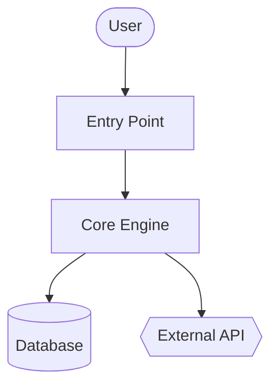
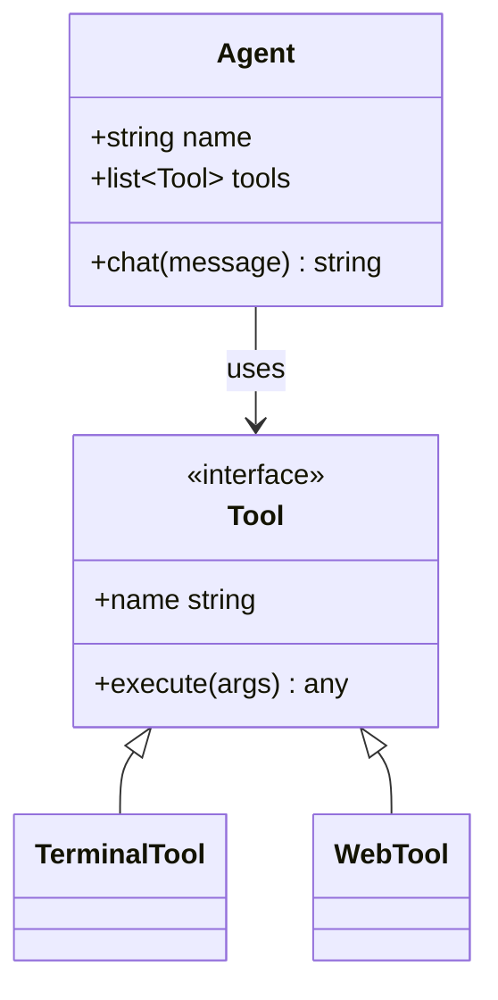
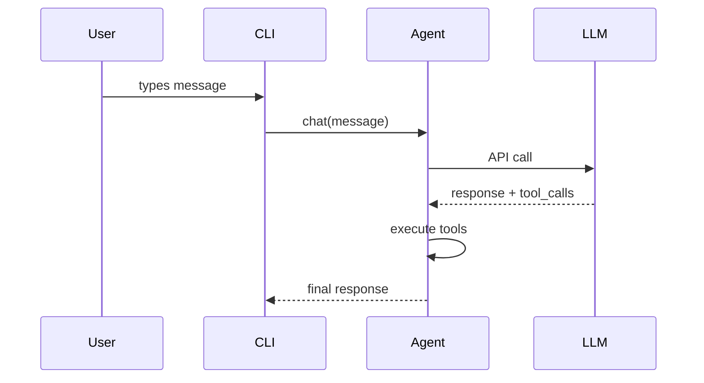

{/* This page is auto-generated from the skill's SKILL.md by website/scripts/generate-skill-docs.py. Edit the source SKILL.md, not this page. */}

# Code Wiki

为任意代码库生成 wiki 文档 + Mermaid 图表。

## Skill 元数据

| | |
|---|---|
| 来源 | 可选 —— 通过 `hermes skills install official/software-development/code-wiki` 安装 |
| 路径 | `optional-skills/software-development/code-wiki` |
| 版本 | `0.1.0` |
| 作者 | Teknium (teknium1)、Hermes Agent |
| 许可证 | MIT |
| 平台 | linux, macos, windows |
| 标签 | `Documentation`, `Mermaid`, `Architecture`, `Diagrams`, `Wiki`, `Code-Analysis` |
| 相关 skill | [`codebase-inspection`](/user-guide/skills/bundled/github/github-codebase-inspection)、[`github-repo-management`](/user-guide/skills/bundled/github/github-github-repo-management) |

## 参考：完整 SKILL.md

:::info
以下是 Hermes 在触发此 skill 时加载的完整 skill 定义。这是 skill 激活时 agent 所看到的指令内容。
:::

# Code Wiki Skill

为任意代码库生成一套完整的 wiki——概览、架构、逐模块深入讲解、Mermaid 类图与时序图。灵感来自 Google CodeWiki，但可用于本地仓库、私有仓库以及任何语言。它只使用现有的 Hermes 工具（`terminal`、`read_file`、`search_files`、`write_file`）；不需要 Docker，不需要外部服务，不需要额外依赖。

此 skill 产出的是**参考文档**（是什么/怎么做）。它不产出战略性叙事（为什么——那是另一个 skill 的事）。

## 适用场景

- 用户说"给这个代码库写文档"、"生成一份 wiki"、"画架构图"
- 刚接手一个陌生仓库，想要一份结构化的参考资料
- 用户给出一个 GitHub URL 并要求生成文档
- 需要一份能在 GitHub 上渲染的稳定产物（markdown + Mermaid）

以下情况不要使用：
- 单文件或单函数的文档——直接回答即可
- 某一个具体端点的 API 参考——用 `read_file` 并直接内联回答
- "这东西为什么存在"的战略性叙事——那是另一个 skill、另一种目的
- 用户正在本次会话中活跃开发的代码库——有问题随时回答即可

## 前提条件

- 不需要任何环境变量。
- PATH 上需有 `git`，用于跟踪仓库 SHA 和克隆远程仓库。
- 可选：`pygount` 用于语言构成统计（参见 `codebase-inspection` skill）。

## 如何运行

在目标仓库根目录下通过 `terminal` 工具调用，然后用 `read_file` / `search_files` / `write_file` 产出 wiki。默认输出位置是 `~/.hermes/wikis/<repo-name>/`。只有在用户明确要求时才写入仓库内部（`docs/wiki/`）。

## 快速参考

| 步骤 | 操作 |
|---|---|
| 1 | 确定目标 —— 本地 cwd、给定路径，或 `git clone --depth 50 <url>` 到临时目录 |
| 2 | 扫描结构 —— `ls`、`find -maxdepth 3`、清单文件、README |
| 3 | 挑选 8–10 个模块来写文档 |
| 4 | 编写 `README.md`（概览 + 模块地图） |
| 5 | 编写带 Mermaid 流程图的 `architecture.md` |
| 6 | 在 `modules/` 中编写逐模块文档 |
| 7 | 编写 `diagrams/class-diagram.md`（Mermaid classDiagram） |
| 8 | 编写 `diagrams/sequences.md`（Mermaid sequenceDiagram，2–4 个工作流） |
| 9 | 编写 `getting-started.md` |
| 10 | 如适用则编写 `api.md`，否则跳过 |
| 11 | 编写 `.codewiki-state.json` |
| 12 | 向用户报告各文件路径 |

## 步骤

### 1. 确定目标

对于 GitHub URL：

```bash
WIKI_TMP=$(mktemp -d)
git clone --depth 50 <url> "$WIKI_TMP/repo"
cd "$WIKI_TMP/repo"
REPO_SHA=$(git rev-parse HEAD)
REPO_NAME=$(basename <url> .git)
```

对于本地路径（未给出则用 cwd）：

```bash
cd <path>
REPO_SHA=$(git rev-parse HEAD 2>/dev/null || echo "uncommitted")
REPO_NAME=$(basename "$PWD")
```

然后设置输出目录：

```bash
OUTPUT_DIR="$HOME/.hermes/wikis/$REPO_NAME"
mkdir -p "$OUTPUT_DIR/modules" "$OUTPUT_DIR/diagrams"
```

### 2. 扫描仓库结构

shell 相关的工作用 `terminal` 工具，读取清单文件用 `read_file`：

```bash
# Shallow tree first
ls -la

# Deeper tree, noise filtered
find . -type d \
  -not -path '*/\.*' \
  -not -path '*/node_modules*' \
  -not -path '*/venv*' \
  -not -path '*/__pycache__*' \
  -not -path '*/dist*' \
  -not -path '*/build*' \
  -not -path '*/target*' \
  -maxdepth 3 | sort

# Language breakdown (skip if pygount unavailable)
pygount --format=summary \
  --folders-to-skip=".git,node_modules,venv,.venv,__pycache__,.cache,dist,build,target" \
  . 2>/dev/null || true
```

然后用 `read_file` 读取相关的清单文件（`package.json`、`pyproject.toml`、`setup.py`、`Cargo.toml`、`go.mod`、`pom.xml`、`build.gradle`）以及项目 README。用 `search_files target='files'` 找到它们，不要靠猜文件名。

### 3. 挑选要写文档的模块

首轮上限为 **8–10 个模块**。按语言的启发式规则：

- Python：顶层包（含 `__init__.py` 的目录），加上各子系统目录
- JS/TS：`src/<subdir>`、顶层 workspace 目录
- Rust：workspace 中的每个 crate，或顶层 `src/<module>` 目录
- Go：每个顶层包目录
- 混合/不熟悉的语言：包含源代码的顶层目录（不含配置、不含测试）

对于超大仓库，按以下顺序排优先级：
1. 被导入次数（被很多地方导入的模块属于核心）
2. LOC（更大的模块通常值得单独一篇文档）
3. 在 README / 顶层文档中被提及的情况

在大仓库上生成逐模块文档之前，先把模块清单告诉用户——给他们一个调整方向的机会。

### 4. 编写 `README.md`

用 `read_file` 读取项目真实的 README 以及排名前 2–3 的入口文件。然后 `write_file`：

````markdown
# <Project Name>

<One paragraph: what it is and what it's for. Self-contained — don't assume the
reader has the source README.>

## Key Concepts

- **<Concept 1>** — <one line>
- **<Concept 2>** — <one line>

## Entry Points

- [`path/to/main.py`](https://github.com/NousResearch/hermes-agent/blob/main/optional-skills/software-development/code-wiki/<link>) — <what runs when you start it>
- [`path/to/cli.py`](https://github.com/NousResearch/hermes-agent/blob/main/optional-skills/software-development/code-wiki/<link>) — <CLI surface>

## High-Level Architecture

<2-3 sentences. Detail goes in architecture.md.>

See [architecture.md](https://github.com/NousResearch/hermes-agent/blob/main/optional-skills/software-development/code-wiki/architecture.md).

## Module Map

| Module | Purpose |
|---|---|
| [`<module>`](https://github.com/NousResearch/hermes-agent/blob/main/optional-skills/software-development/code-wiki/modules/<module>.md) | <one-line purpose> |

## Getting Started

See [getting-started.md](https://github.com/NousResearch/hermes-agent/blob/main/optional-skills/software-development/code-wiki/getting-started.md).
````

本地模式下的链接目标使用相对路径。对于克隆下来的仓库，使用 `https://github.com/<owner>/<repo>/blob/<sha>/<path>`，这样链接在后续提交后仍然有效。

### 5. 编写 `architecture.md`

````markdown
# Architecture

<2-3 paragraphs: shape of the system. What talks to what. Where data enters,
where it exits, where state lives.>

## Components

- **<Component>** — <1-2 sentences>. See [`modules/<module>.md`](https://github.com/NousResearch/hermes-agent/blob/main/optional-skills/software-development/code-wiki/modules/<module>.md).

## System Diagram



## Data Flow

1. **<Step>** — [`<file>`](https://github.com/NousResearch/hermes-agent/blob/main/optional-skills/software-development/code-wiki/<link>)
2. **<Step>** — [`<file>`](https://github.com/NousResearch/hermes-agent/blob/main/optional-skills/software-development/code-wiki/<link>)

## Key Design Decisions

- <Anything load-bearing the reader should know>
````

**Mermaid 形状语义：**
- `[]` = 组件
- `[()]` = 数据库 / 存储
- `{{}}` = 外部服务
- `(())` = 入口点或终端节点
- `-->` = 同步调用，`-.->` = 异步/事件

每张图上限约 20 个节点。更大就拆成子图。

### 6. 在 `modules/` 中编写逐模块文档

对每个选定的模块，用 `ls` 查看其布局，找出 3–5 个最重要的文件（按体积、按是否叫 `core.py` / `main.py` / `__init__.py`、按被导入的频繁程度），然后用 `read_file` 读取这些文件（用 `offset` / `limit` 只读你需要的部分；查找具体符号时优先用 `search_files`）。

````markdown
# Module: `<module>`

<1-2 sentence purpose.>

## Responsibilities

- <bullet>
- <bullet>

## Key Files

- [`<module>/<file>`](https://github.com/NousResearch/hermes-agent/blob/main/optional-skills/software-development/code-wiki/<link>) — <what it does>

## Public API

<Functions/classes/constants other code uses. Group related items. Show
signatures, not full implementations.>

## Internal Structure

<How the module is organized internally. State management.>

## Dependencies

- **Used by:** <other modules>
- **Uses:** <other modules + external libs>

## Notable Patterns / Gotchas

- <Anything non-obvious>
````

### 7. 编写 `diagrams/class-diagram.md`

挑出 5–10 个最重要的类/类型。用 `read_file` 读取它们，然后编写：

````markdown
# Class Diagram

## Core Types



## Notes

<Anything the diagram can't express — lifecycle, threading, etc.>
````

对于没有类概念的语言（Go、C、Rust）：把图用于表达结构体之间的关系，或者干脆跳过 class-diagram.md，在 architecture.md 里用文字说明。不要生搬硬套。

### 8. 编写 `diagrams/sequences.md`

挑出 2–4 个最重要的工作流。逐个追踪其在代码中的调用路径（读入口点，跟着函数调用走），然后：

````markdown
# Sequence Diagrams

## Workflow: <Name>

<1 sentence describing what this does and when it runs.>



### Walkthrough

1. **User input** — [`cli.py:HermesCLI.run_session`](https://github.com/NousResearch/hermes-agent/blob/main/optional-skills/software-development/code-wiki/<link>)
2. **Message dispatch** — [`run_agent.py:AIAgent.chat`](https://github.com/NousResearch/hermes-agent/blob/main/optional-skills/software-development/code-wiki/<link>)
````

不要凭空编造参与者。每一个框都必须对应读者能在代码中找到的真实组件。

### 9. 编写 `getting-started.md`

````markdown
# Getting Started

## Prerequisites

<From manifest files + README. Be specific — versions if pinned.>

## Installation

```bash
<exact commands>
```

## First Run

```bash
<minimum command to see the system do something useful>
```

## Common Workflows

### <Workflow 1>
<commands>

## Configuration

- `<config-file>` — <what it controls>
- Env var `<VAR>` — <what it controls>

## Where to Go Next

- Architecture: [architecture.md](https://github.com/NousResearch/hermes-agent/blob/main/optional-skills/software-development/code-wiki/architecture.md)
- Module reference: [README.md#module-map](https://github.com/NousResearch/hermes-agent/blob/main/optional-skills/software-development/code-wiki/README.md#module-map)
````

### 10. 编写 `api.md`（不适用则跳过）

只有当项目是一个库或 API 服务时才写这一篇。如果是：

- 找出公共 API 界面（`__init__.py` 的导出、OpenAPI 规范、路由处理函数、导出的类型）
- 为每个公共入口记录签名、参数、返回类型和一行说明
- 按类别分组

### 11. 编写状态文件

```bash
cat > "$OUTPUT_DIR/.codewiki-state.json" <<EOF
{
  "repo_name": "$REPO_NAME",
  "source_path": "$PWD",
  "source_sha": "$REPO_SHA",
  "generated_at": "$(date -u +%Y-%m-%dT%H:%M:%SZ)",
  "generator": "hermes-agent code-wiki skill v0.1.0",
  "modules_documented": []
}
EOF
```

### 12. 向用户报告

明确说明生成了什么、放在哪里：

```
Generated wiki at ~/.hermes/wikis/<repo-name>/:
  README.md                   project overview, module map
  architecture.md             system architecture + flowchart
  getting-started.md          setup, first run, workflows
  modules/<N files>           per-module deep-dives
  diagrams/architecture.md    Mermaid flowchart
  diagrams/class-diagram.md   Mermaid class diagram
  diagrams/sequences.md       Mermaid sequence diagrams
```

如果你克隆到了临时目录，提醒用户在他们看完 wiki 之后可以把它删掉（`rm -rf "$WIKI_TMP"`）。

## 范围控制

为一个 50 万行代码的 monorepo 生成完整 wiki 的 token 开销极其高昂。默认采用有界范围：

- 初次扫描：目录最大深度 3
- 逐模块文档：除非用户扩大范围，否则上限 10 个模块
- 单文件读取：优先用 `search_files` 查符号 + 带 `offset`/`limit` 的 `read_file`，而不是整文件读取
- 跳过第三方内置代码（`vendor/`、`third_party/`、生成的代码、`_pb2.py`、`.min.js`）

如果用户说"把整个仓库彻底做一遍"，那就相信他们——但先估算成本："这个仓库大约有 340 个源文件，做全面覆盖会很贵——确认继续吗？"

## 重跑 / 更新

如果目标路径下已经存在 `.codewiki-state.json`：

- 读取它以获得上一次的 SHA 和模块列表
- 如果源 SHA 相同：询问用户是要重新生成还是跳过
- 如果 SHA 不同：提出只重新生成那些文件有变动的模块（`git diff --name-only <old-sha> HEAD`）

完整的增量重生成是未来的增强功能——目前，整体重新生成是可以接受的。

## 陷阱

- **编造组件。** 每一个图上的节点、每一处声称存在的函数调用都必须在源代码中。写之前先 `read_file`。自动生成文档最大的失败模式就是听起来很合理的编造。
- **泛泛的 AI 腔文字。** "本模块负责……"是零信息量的。用领域相关的术语说清这个模块究竟做了什么。
- **把代码复述成散文。** 一篇写着"`process` 函数通过对每一项调用 `process_item` 来处理事物"的模块文档，还不如直接给出该函数的链接。
- **Mermaid 图超过 50 个节点。** 它们渲染出来无法辨认。拆开。
- **把测试、生成的代码或第三方内置依赖当作产品代码来写文档。** 跳过它们。
- **未经询问就把输出写进仓库。** 默认是 `~/.hermes/wikis/`。只有在用户明确要求时才写入仓库内部。
- **Mermaid 中的特殊字符需要引号：** 用 `A["Tool / Agent"]` 而不是 `A[Tool / Agent]`。节点内换行用 `<br>`。
- **SKILL.md 中的嵌套代码围栏。** 当你写的 markdown 示例里包含 Mermaid 块时，外层要用 4 个反引号的围栏，这样内层 3 个反引号的 ` ```mermaid ` 才不会把外层闭合。（本 SKILL.md 就是这么做的。）
- **classDiagram 的泛型**渲染为 `~T~`（例如 `List~Tool~`），而不是 `<T>`。
- **GitHub 的 Mermaid 主题是固定的** —— 不要包含 `%%{init: ...}%%` 块；渲染时会被剥离。

## 验证

写完之后，请验证：

1. **Mermaid 块配对平衡** —— 每个文件中开与闭的数量相等：
   ```bash
   for f in "$OUTPUT_DIR"/diagrams/*.md "$OUTPUT_DIR"/architecture.md; do
     opens=$(grep -c '^```mermaid' "$f")
     total=$(grep -c '^```' "$f")
     echo "$f: $opens mermaid blocks, $total total fences (expect total = opens*2)"
   done
   ```
2. **所有预期文件都存在** ——
   ```bash
   ls "$OUTPUT_DIR"/{README.md,architecture.md,getting-started.md,.codewiki-state.json} \
      "$OUTPUT_DIR"/modules/ "$OUTPUT_DIR"/diagrams/
   ```
3. **模块数量与你的预期一致** —— `ls "$OUTPUT_DIR/modules" | wc -l` 应当等于你在步骤 3 中承诺的模块数量。
4. **没有编造的路径** —— 抽查 2–3 个源码链接，确认它们指向真实文件。
